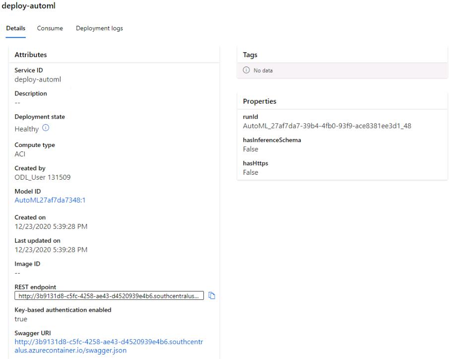
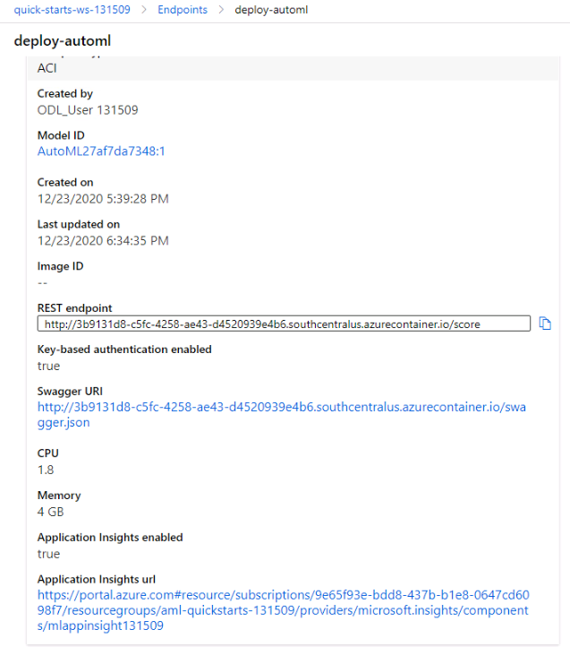
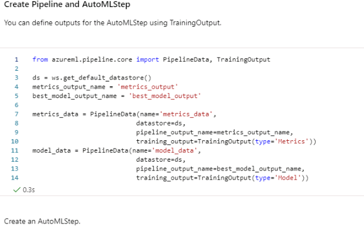

# Operationalizing Machine Learning

## Overview
This project is part of the Udacity Azure ML Nanodegree.
In this project, a cloud-based machine learning production model is created, deployed it in Azure container instance, and consumed it using REST API.

## Summary
This dataset contains data about [Bank Marketing](https://automlsamplenotebookdata.blob.core.windows.net/automl-sample-notebook-	data/bankmarketing_train.csv"). The details about each applicant is available along with historical transactional data to predict whether the applicant will subscribe for long term deposit or not. 
A classification algorithm is used to train model using AUTO ML and the best model that provides better accuracy is selected and deployed in Azure container instance(ACI). The deployed model provides end point to send request to REST API and also Swagger URI. Document is generated using swagger and models are consumed using end point.
AutoML pipeline is created using Axure SDK in notebook and pipeline is delpoyed.

The Architecture:

# Project main steps
In this project, the following steps are executed :

* ### Automated ML Experiment:
  * **`Dataset`**:
  Bank marketing data set is registered. A classification algorithm is selected and an experiment is created and executed on a standard_ds12_v2 cluster.
 
	
 
	
 
	The best model choosen is VotingEnsemble that haa resulted in 91.9% Accuracy. 
	
	
  * **Metrics**:	
	
	
	
 
 
* ### **`Deploy the best model`**:

	The model(deploy-automl) is deployed using Azure Container instance(ACI). 
	REST API is generated and URI for Swagger is also generated. 
	Applications insights is set to false.
	
	
    
* ### **`Enable logging`**:

	Logs.py is loaded and applications insights is set to 'True'.
	
	
	
	
	
	
	
	
	     	
     
* ### **`Swagger Documentation`**:

    Swagger.json file is downloaded and port number is changed 9000 as default one is used. 
    Swagger API is tested and Serve.py is executed to enable Swagger 'Get' and 'POST' API from local host

    
	
    
* ### **`Consume model using endpoint`**:

    Endpoint is modified with required suitable URI and key. This will generate data.json. 
    
    
    

    
    
    
    The benchmark file is executed.	
    
 
###  `Create Pipeline and publish` 
* ### **`Create and publish a pipeline`**:

   	In the notepad, the bank marketing data is loaded .
   	
   
* 'The pipeline' is created for BankMarketing_experiment and it is published.
   	
   	.PNG)
	
   **Pipeline Created in ML Studio**:
	
   
* **The rest 'endpoint' is created and published**
   	
	
	
   
* **The pipeline run is dispayed in ML studio**
   	
	
    
* **The endpoints are consumed as shown in ML studio**  
  	
	
	
	
	
     
* ### **Documentation**

  	The video is created to explain entire process of AUTO ML studio
  
  [Operationalizing Machine Learning from Azure](https://www.youtube.com/watch?v=_QTYBboZXrg)
  
##  The steps to improve the project
	* The model performance can be increased by analyzing the the Bank Marketing data and ensuring that it is balanced properly.
	  Either oversampling or undersampling methods can be used
	
	* We can check train and test set split methods like stratefied split and holdout based validation to check if that results in better accuracy
	  We can fine tune all hyper parameters and check if it can enhance performance of the model.
	
	* The present model achieved accuracy of 91.5% which is considered as good accuracy. 
	  Further more deep learning models can be used to further enhance model accuracy
	  Deep learning can be enabled through AUTO ML config by setting enable_dnn parameter to TRUE
	
	
	
