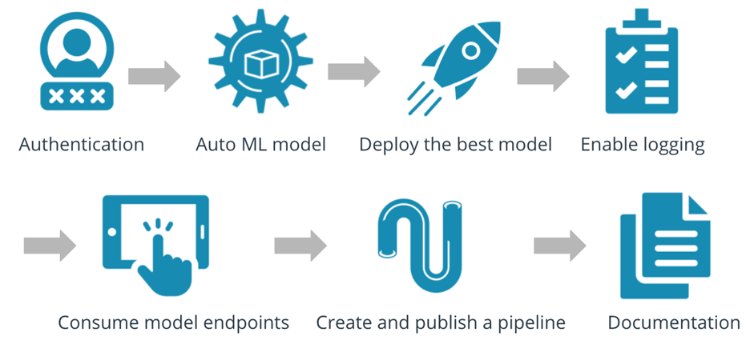
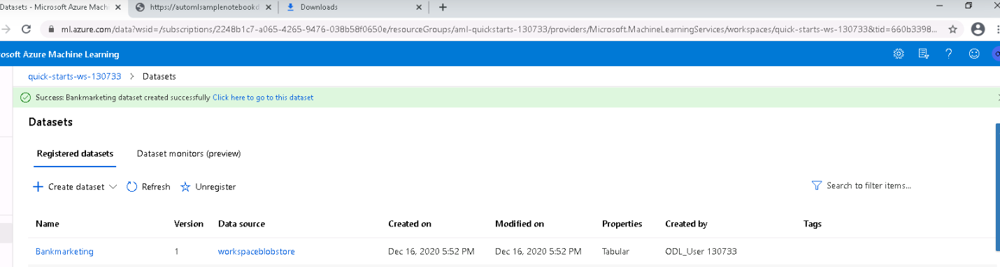
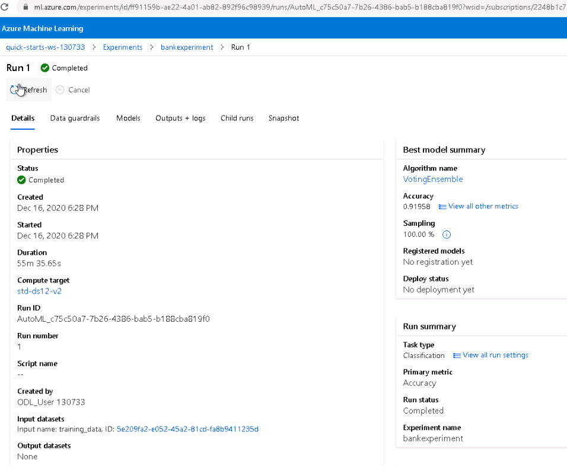
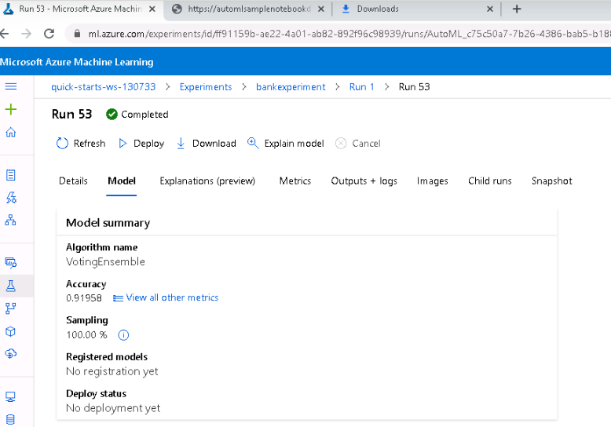
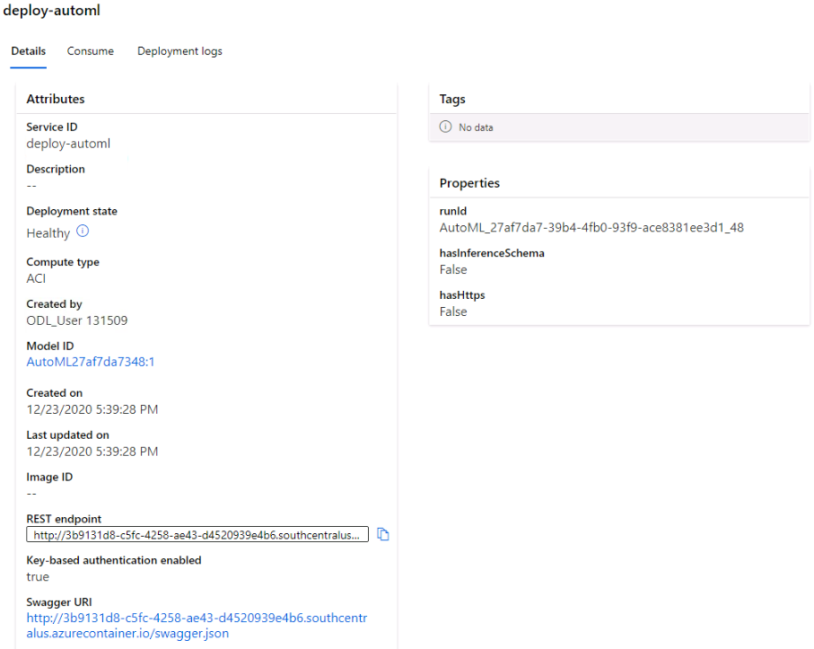
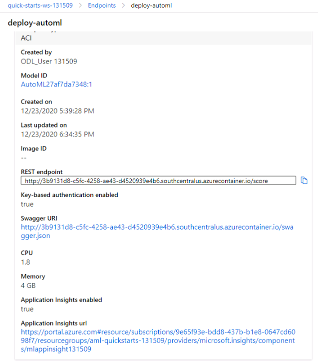
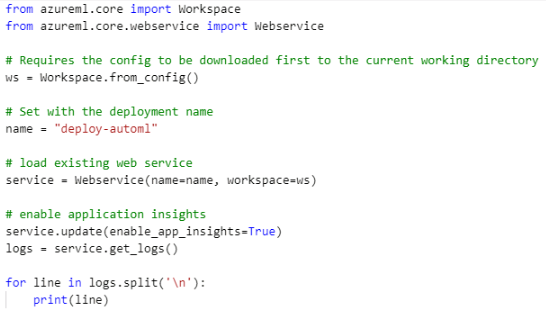
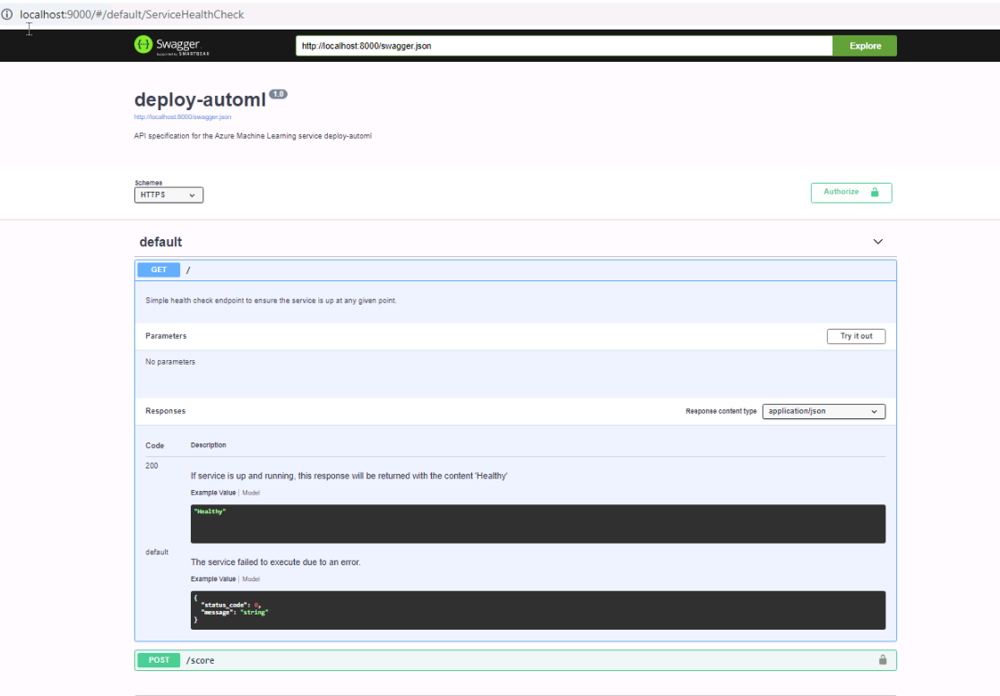
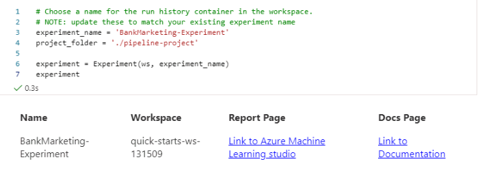
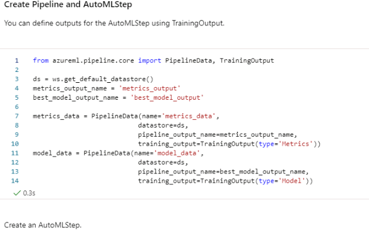

 # Operationalizing Machine Learning

## Overview
This project is part of the Udacity Azure ML Nanodegree.
In this project, a cloud-based machine learning production model is created, deployed it in Azure container instance, and consumed it using REST API.

## Summary
This dataset contains data about bank marketing. The details about each applicant is available along with historical transactional data to predict whether customer is eligible for loan or not. A classification algorithm is used to train model and the best model is deployed. Document is generated using swagger and modelis consumed using end point.
AutoML pipeline is created using Axure SDK in notebook and delpoyed.

The Architecture:

# Project main steps
In this project, you will following the below steps:

* Automated ML Experiment
  Bank marketing data set is registered. A classification algorithm is selected and an experiment is created and executed on a standard_ds12_v2 cluster.
  
 
 
 
 
 The best model is choosen is VotingEnsemble that ha resulted in 91.9% Accuracy.
 
 
 
* Deploy the best model
   The model(deploy-automl) is deployed using Azure Container instance(ACI). REST API is generated and URI for Swagger is also generated. Applications insights is set to false.
    
    
   
* Enable logging
	Logs.py is loaded and applications insights is set to True.
     
     
* Swagger Documentation
    Swagger.json file is downloaded and port number is changed 9000 as default one is used. Swagger API is tested and Serve.py is executed to enable Swagger Get and POST API from local host
    
    
    
* Consume model endpoints
    Endpoint is modified with required suitble URI and key. This will generate data.json. The benchmark file is executed.
      
      
* Create and publish a pipeline
   In the notepad, the bank marketing data is loaded .
   
   
   The pipeline is created for BankMarketing_experiment and it is published.
   
   .PNG)
   
   The rest endpoint is created and published
   
   
   The pipeline run is dispayed in ML studio
    
    
   The endpoints are consumed as shown in ML studio  
     
     
* Documentation
  The video is created to explain entire process of AUTO ML studio
  
  [Operationalizing Machine Learning from Azure](https://youtu.be/-DrpDr3xqic)
  
  
